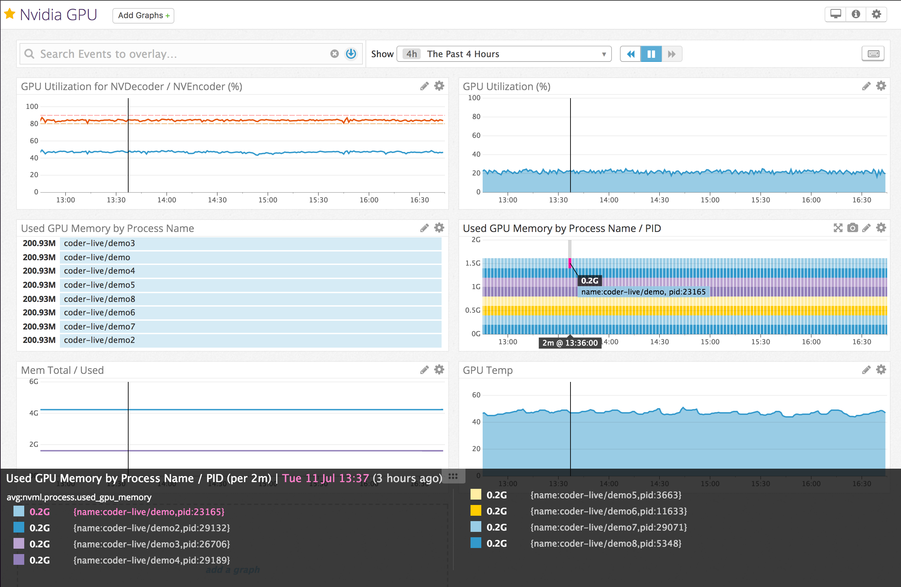

# datadog_nvml

Monitoring NVIDIA GPUs status using Datadog

`Datadog Agent Check` To capture and send metrics

`nvidia-ml-py` Python Module as API interface




## Current Monitor Supported

Currently we will acquire the following items for each GPU.

### Metrics

- nvml.util.gpu: Percent of time over the past sample period during which one or more kernels was executing on the GPU.
- nvml.util.memory: Percent of time over the past sample period during which global (device) memory was being read or written.
- nvml.util.decode: Percent of usage of HW Decoding (NVDEC) from the last sample period (*)
- nvml.util.encode: Percent of usage of HW Encoding (NVENC) from the last sample period (*)
- nvml.mem.total: Total Memory
- nvml.mem.used: Used Memory
- nvml.mem.free: Free Memory
- nvml.temp: Temperature
- nvml.gpus.number: Number of active GPUs
- nvml.throttle.appsettings: Clocks are being throttled by the applications settings
- nvml.throttle.display: Clocks are being throttled by the Display clocks settings
- nvml.throttle.hardware: Clocks are being throttled by a factor of 2 or more due to high temperature, high power draw, and/or PState or clock change
- nvml.throttle.power.hardware: Clocks are being throttled due to the External Power Brake Assertion being triggered (e.g., by the system power supply)
- nvml.throttle.idle: Clocks are being throttled to Idle state because nothing is running on the GPU
- nvml.throttle.power.software: Clocks are being throttled by the software power scaling algorithm
- nvml.throttle.syncboost: Clocks are being throttled because this GPU is in a sync boost group and will sync to the lowest possible clocks across the group
- nvml.throttle.temp.hardware: Clocks are being throttled by a factor of 2 or more due to high temperature
- nvml.throttle.temp.software: Clocks are being throttled due to high GPU core and/or memory temperature
- nvml.throttle.unknown: Clocks are being throttled due to an unknown reason

(*) HW accelerated encode and decode are supported on NVIDIA GeForce, Quadro, Tesla, and GRID products with Fermi, Kepler, Maxwell and Pascal generation GPUs.

### Tags

- name: GPU (GEFORCE_GTX_660)


# REQUIRES

nvidia-ml-py (v7.352.0)

- https://pypi.python.org/pypi/nvidia-ml-py

```
$ sudo /opt/datadog-agent/embedded/bin/pip install nvidia-ml-py==7.352.0
```

Check that was correctly installed:
```
# /opt/datadog-agent/embedded/bin/pip show nvidia-ml-py
Name: nvidia-ml-py
Version: 7.352.0
Summary: Python Bindings for the NVIDIA Management Library
Home-page: http://www.nvidia.com/
Author: NVIDIA Corporation
Author-email: nvml-bindings@nvidia.com
License: BSD
Location: /opt/datadog-agent/embedded/lib/python2.7/site-packages
```
# SETUP

Get the two files and placed them at:

- nvml.py: /etc/dd-agent/checks.d
- nvml.yaml.default: /etc/dd-agent/conf.d

with the command:
```
$ sudo wget https://raw.githubusercontent.com/ngi644/datadog_nvml/master/nvml.py -O /etc/datadog-agent/checks.d/nvml.py
$ sudo wget https://raw.githubusercontent.com/ngi644/datadog_nvml/master/nvml.yaml.default -O /etc/datadog-agent/conf.d/nvml.yaml.default
```

Restart Datadog Agent, to compile the PY Source and update the check file.

```
$ sudo service datadog-agent restart
```
Check if module was loaded correctly
```
$ sudo service datadog-agent info
```
or
```
$ sudo datadog-agent status
```

Result should look like:
```
Checks
  ======
...
    nvml (5.14.1)

      - instance #0 [OK]
      - Collected 16 metrics, 0 events & 1 service check
...
```
or with:
```
$ sudo datadog-agent status
```
Result should look like:
```
Checks
  ======
...
    nvml (0.1.4)
    ------------
      Instance ID: nvml:d9950296b931429 [OK]
      Total Runs: 1
      Metric Samples: Last Run: 8, Total: 8
      Events: Last Run: 0, Total: 0
      Service Checks: Last Run: 1, Total: 1
      Average Execution Time : 700ms
...
```


# Tested
  Tested on AWS EC2 G2 Familly (g2.2xlarge) that include 1x NVIDIA GRID K520 card.
  Tested on Bare-metal Supermicro server with NVIDIA TESLA P4 and P40 cards.
  
# References

- https://pypi.python.org/pypi/nvidia-ml-py/
- http://pythonhosted.org/nvidia-ml-py/
- http://docs.datadoghq.com/guides/agent_checks/
- https://developer.nvidia.com/video-encode-decode-gpu-support-matrix
- https://developer.nvidia.com/nvidia-video-codec-sdk
- https://docs.nvidia.com/deploy/nvml-api/index.html
