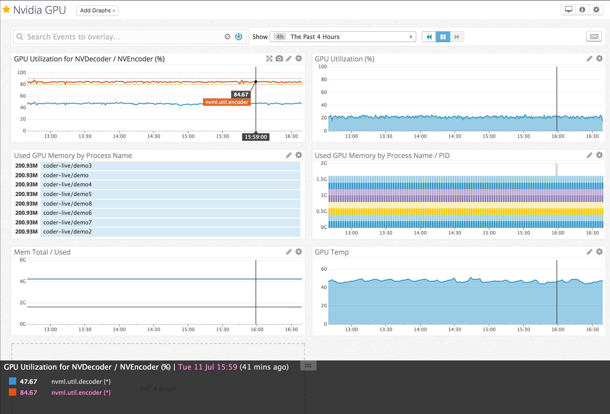

# datadog_nvml

Monitoring NVIDIA GPUs status using Datadog

`Datadog Agent Check` To capture and send metrics

`nvidia-ml-py` Python Module as API interface




## Current Monitor Supported

Currently we will acquire the following items for each GPU.

### Metrics

- nvml.util.gpu: Percent of time over the past sample period during which one or more kernels was executing on the GPU.
- nvml.util.memory: Percent of time over the past sample period during which global (device) memory was being read or written.
- nvml.util.decode: Percent of usage of HW Decoding (NVDEC) from the last sample period (*)
- nvml.util.encode: Percent of usage of HW Encoding (NVENC) from the last sample period (*)
- nvml.mem.total: Total Memory
- nvml.mem.used: Used Memory
- nvml.mem.free: Free Memory
- nvml.temp: Temperature

(*) HW accelerated encode and decode are supported on NVIDIA GeForce, Quadro, Tesla, and GRID products with Fermi, Kepler, Maxwell and Pascal generation GPUs.

### Tags

- name: GPU (GEFORCE_GTX_660)


# REQUIRES

nvidia-ml-py (v7.352.0)

- https://pypi.python.org/pypi/nvidia-ml-py

```
$ sudo /opt/datadog-agent/embedded/bin/pip install nvidia-ml-py==7.352.0
```

Check that was correctly installed:
```
# /opt/datadog-agent/embedded/bin/pip show nvidia-ml-py
Name: nvidia-ml-py
Version: 7.352.0
Summary: Python Bindings for the NVIDIA Management Library
Home-page: http://www.nvidia.com/
Author: NVIDIA Corporation
Author-email: nvml-bindings@nvidia.com
License: BSD
Location: /opt/datadog-agent/embedded/lib/python2.7/site-packages
```
# SETUP

Copy the two files to the `checks.d, conf.d` directory in the` /etc/dd-agent` directory.

- nvml.py: /etc/dd-agent/checks.d
- nvml.yaml.default: /etc/dd-agent/conf.d

```
$ git clone https://github.com/ngi644/datadog_nvml.git
$ cd datadog_nvml
$ sudo cp nvml.py /etc/dd-agent/checks.d
$ sudo cp nvml.yaml.default /etc/dd-agent/conf.d
```

Restart Datadog Agent, to compile the PY Source and update the check file.

```
$ sudo service datadog-agent restart
```
Check if module was loaded correctly
```
$ sudo service datadog-agent info
```

```
Checks
  ======
...
    nvml (5.14.1)

      - instance #0 [OK]
      - Collected 16 metrics, 0 events & 1 service check
...
```

# Tested
  Tested on AWS EC2 G2 Familly (g2.2xlarge) that include 1x NVIDIA GRID K520 card.
  
# References

- https://pypi.python.org/pypi/nvidia-ml-py/
- http://pythonhosted.org/nvidia-ml-py/
- http://docs.datadoghq.com/guides/agent_checks/
- https://developer.nvidia.com/video-encode-decode-gpu-support-matrix
- https://developer.nvidia.com/nvidia-video-codec-sdk
- https://docs.nvidia.com/deploy/nvml-api/index.html
